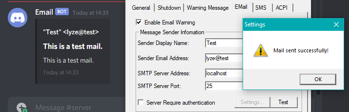

# Overview

The program redirects all emails received on port 25 to a discord webhook.

# Settings

Add the webhook url to `appsettings.json`:

```json
{
  "Logging": {
    "LogLevel": {
      "Default": "Information",
      "Microsoft": "Warning",
      "Microsoft.Hosting.Lifetime": "Information"
    }
  },
  "Webhook": "https://discordapp.com/api/webhooks/..."
}
```

# Example:

